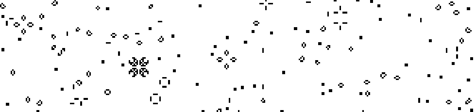

# Game of Life

Implementation of [Conway's Game of Life](https://en.wikipedia.org/wiki/Conway%27s_Game_of_Life) in Typescript and React. The game board is rendered into an HTML canvas element. A working demo is available [here](https://ryantate13.github.io/game-of-life/).

## Rules

The game is setup to use Conway's initial rule set, B3/S23 in cellular automata notation. Each dead cell with 3 live neighbors becomes a live cell and any live cell with 2 or 3 live neighbors survives into the next generation. No other cells are altered in a generation.

## Initial State

At the onset the board is populated with [gliders](https://en.wikipedia.org/wiki/Conway%27s_Game_of_Life#Examples_of_patterns). Each glider is in the center of a 25x25 cell grid.

## Controls

Click `▶` to start processing generations and `⏸` to pause the game. The speed at which generations are processed can be controlled by selecting values in the `Frames per Second` dropdown. To generate a random board, click `↻`. The random board will be populated with a percentage of live cells corresponding to the `Fill Rate`. 


| Initial State            | | Random Board            |
|--------------------------|-|-------------------------|
|  | |  |

## Development

The included `Makefile` encapsulates needed commands for development. The only required dependencies are GNU `make`, `docker`, `docker-compose` and a POSIX shell. On Windows, WSL should work.

Run `make dev` to launch the React dev server and the test suite. Each time a file is saved the UI will reload and the test suite will be re-ran. 


## Running the Test Suite

Run `make test` to run the test suite. Jest will run inside a docker container and print out a coverage report when complete. 

```
➜  game-of-life git:(master) ✗ make test

docker run --rm life npm test -- --colors --coverage --verbose

> game-of-life@1.0.0 test /app
> react-scripts test "--colors" "--coverage" "--verbose"

 PASS  src/Game.test.tsx
  GLIDER
    ✓ represents a glider pattern placed in the middle of 25x25 cell universe (4ms)
  init
    ✓ creates an initial board for the game comprised of centered gliders in 25x25 cell regions (1ms)
    ✓ creates multiple gliders in 25x25 regions if the board size is larger than 25x25 (8ms)
  to_xy
    ✓ deserializes a coordinate into an X,Y pair (1ms)
  neighbors
    ✓ gets the neighbors of a cell (2ms)
  generation
    ✓ processes the next tick of a game of life board (15ms)
  Game
    ✓ renders a game universe to an HTML canvas (26ms)
  dispatch_dimensions
    ✓ dispatches the dimensions of the canvas' wrapper div (1ms)
  draw_canvas
    ✓ takes the current game state and renders it to an html canvas element (4ms)

 PASS  src/useDispatch.test.tsx
  useDispatch
    ✓ uses hooks to create a strongly typed redux in ~10 lines of code (17ms)
    ✓ supports synchronous state transformations (3ms)
    ✓ supports asynchronous state transformations (1ms)

 PASS  src/index.test.ts
  index
    ✓ renders the app into the DOM (2ms)
    ✓ registers a service worker

 PASS  src/Header.test.tsx
  Header
    ✓ renders the controls for the game (98ms)
    ✓ selectively disables elements based on pause state (37ms)

 PASS  src/App.test.tsx
  App
    ✓ renders the root of the app (25ms)
    ✓ sets up initial state (1ms)
  reducer
    ✓ handles state transformations for the app (1593ms)

----------------|----------|----------|----------|----------|-------------------|
File            |  % Stmts | % Branch |  % Funcs |  % Lines | Uncovered Line #s |
----------------|----------|----------|----------|----------|-------------------|
All files       |      100 |      100 |      100 |      100 |                   |
 App.tsx        |      100 |      100 |      100 |      100 |                   |
 Game.tsx       |      100 |      100 |      100 |      100 |                   |
 Header.tsx     |      100 |      100 |      100 |      100 |                   |
 Logo.tsx       |      100 |      100 |      100 |      100 |                   |
 index.tsx      |      100 |      100 |      100 |      100 |                   |
 useDispatch.ts |      100 |      100 |      100 |      100 |                   |
----------------|----------|----------|----------|----------|-------------------|
Test Suites: 5 passed, 5 total
Tests:       19 passed, 19 total
Snapshots:   0 total
Time:        4.282s
Ran all test suites.

```
